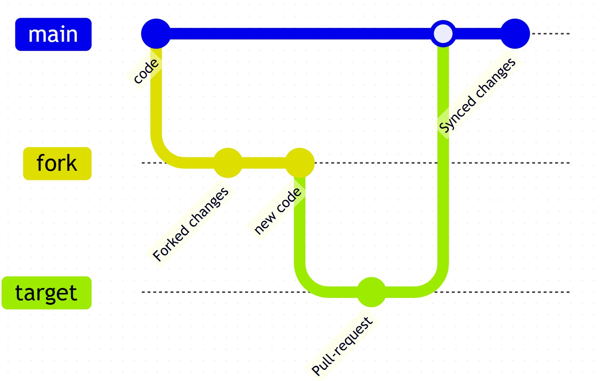

# Fork Sequence

If this repository requires forking for code changes, please follow the steps below:

1. **Create a new fork** of the repository.
2. **Commit your code changes** to the forked repository.
3. **Create a pull request** targeting the desired branch.

## Important Notes

- Due to GitHub token permissions, **forked repositories** should be used instead of committing directly to the main branch.
- Pull requests should use target branch, as some workflows (e.g., auto-labeler) will fail due to missing tokens in forks.
- [GitHub Token Permissions](https://docs.github.com/en/actions/writing-workflows/choosing-what-your-workflow-does/controlling-permissions-for-github_token)

### Workflow Sequence

Below is a visual representation of the sequence:

#### Useful links

1. [List actions and required permissions](https://docs.github.com/en/rest/authentication/permissions-required-for-github-apps?apiVersion=2022-11-28)
2. [List of trigger events for workflows](https://docs.github.com/en/actions/writing-workflows/choosing-when-your-workflow-runs/events-that-trigger-workflows)
